# Final Year Project Proposal

---

<div align="center">

# SECUREASSESS: AN ENTERPRISE-GRADE MULTI-TENANT EXAMINATION, TECHNICAL ASSESSMENT & REAL-TIME INTEGRITY MONITORING PLATFORM

\
**A Capstone Project Proposal Submitted in Partial Fulfillment of the Requirements for the Degree of Bachelor of Science in Computer Science / Software Engineering**

\
**Author / Lead Developer:** Shaheer Ali (shaheer838838@gmail.com)  
**Project Domain:** Cloud Computing, Distributed Systems, Educational Technology (EdTech), Information Security, Real-Time Web Applications  
**Academic Year:** 2025 – 2026  
**Status:** Approved / In Active Development  

</div>

---

## Executive Summary

Remote education, distributed software engineering recruitment, and high-stakes certification examinations have expanded exponentially over the past decade. However, the integrity and trustworthiness of online assessments face unprecedented threats due to the rapid ubiquity of Large Language Models (LLMs), undetectable browser extensions, screen-sharing overlays, and sophisticated cheating paradigms. Simultaneously, existing examination software platforms are hampered by monolithic architectures, rigid tenant coupling, server clock drift, destructive question bank overwrites, and clunky third-party video conferencing integrations.

**SecureAssess** is engineered to resolve these challenges by providing an all-in-one, enterprise-grade, multi-tenant B2B Software-as-a-Service (SaaS) platform for conducting browser-monitored examinations, automated technical evaluations, and peer-to-peer live video interviews. Built on a decoupled identity architecture, a 121-permission Role-Based Access Control (RBAC) matrix, an immutable question snapshotting engine, a server-authoritative runtime attempt state machine, and a pluggable strategy-pattern grading engine, SecureAssess establishes an uncompromised, auditable, and scalable standard for academic institutions and enterprise recruitment.

---

## Table of Contents

```
1 Introduction ................................................................................................... 5
2 Literature Review ............................................................................................... 8
3 Problem Statement ............................................................................................. 14
4 Aims and Objectives .......................................................................................... 19
    4.1 Objective 1: Development and Implementation ............................................ 19
    4.2 Objective 2: Testing and Evaluation .......................................................... 23
5 Methodology ...................................................................................................... 26
    5.1 Phase 1: Component Selection and Testing ................................................... 27
    5.2 Phase 2: Module Integration and Functional Testing .................................... 31
    5.3 Phase 3: Complete System Assembly and Field Testing ................................. 36
6 Scope of Research ............................................................................................. 40
7 Plan of Work / Gantt Chart ................................................................................. 44
8 Significance of Study ......................................................................................... 48
References ........................................................................................................... 52
Appendix A: Major Components Specifications ...................................................... 56
```

---

# 1 Introduction

### 1.1 Context and Background

The global landscape of higher education, vocational training, and corporate talent acquisition has undergone an irreversible structural transformation toward distributed, online-first paradigms. Computer-Based Testing (CBT) and online examination platforms have largely replaced traditional paper-and-pencil testing, offering unprecedented logistical efficiency, automated grading capabilities, geographic inclusivity, and instantaneous analytics. According to recent educational technology market analyses, the global online assessment software market is projected to surpass \$15 billion by 2030, driven by the expanding adoption of distance learning in universities and the normalization of remote technical hiring in multinational enterprises.

Despite this rapid adoption, conducting examinations over unmanaged, candidate-owned personal computers and commercial Internet connections introduces profound systemic vulnerabilities. Traditional exam environments provide physical proctors who supervise candidates, verify identity, control the ambient environment, and prevent unauthorized communication or material consultation. In remote assessment scenarios, this physical security boundary is completely eliminated, placing the full burden of authentication, environment verification, behavioral monitoring, and evidence preservation on the examination software system itself.

```mermaid
graph TD
    subgraph TraditionalTesting ["Traditional Examination Model"]
        PhysRoom["Physical Examination Hall"] --> Invigilator["Human Invigilator Supervision"]
        Invigilator --> PaperExam["Paper / Managed Terminal Exam"]
        PaperExam --> ManualScore["Manual / Optical Scoring"]
    end

    subgraph RemoteChallenge ["Remote Examination Reality"]
        CandidateHome["Candidate Unmanaged PC"] --> AttackVectors["AI Tools / Dual Monitors / Screen Overlays / Proxies"]
        AttackVectors --> CompromisedExam["Compromised Academic Integrity"]
    end

    subgraph SecureAssessSolution ["SecureAssess Enterprise Solution"]
        DecoupledIdentity["Decoupled Multi-Tenant Identity"] --> AuthoritativeRuntime["Authoritative Runtime Engine (Server Timers & Snapshots)"]
        AuthoritativeRuntime --> WebRTCProctoring["Real-Time WebRTC Video & Telemetry Signaling"]
        WebRTCProctoring --> AutomatedEvaluation["Pluggable Automated Graders & Verified Transcripts"]
    end
```

### 1.2 The Paradigm Shift and Emerging Cheating Threat Landscape

The emergence of consumer-accessible Generative Artificial Intelligence (GenAI)—most notably advanced Large Language Models (LLMs) and multimodal vision-language models—has dismantled the foundational security assumptions of first-generation online assessment platforms. Candidates are no longer restricted to static search engines or covert textbook consultation; they can now deploy real-time AI assistants capable of:

1. **Undetected Screen Scraping and OCR**: Utilizing invisible browser extensions, desktop sidecars, or virtual machine video captures that feed assessment questions into LLM prompting APIs.
2. **Real-Time Code and MCQ Generation**: Receiving synthesized answers, step-by-step mathematical reasoning, and optimal algorithmic implementations within seconds.
3. **Hardware-Level Display Splitting**: Splitting video output via HDMI splitters to secondary displays operated by remote accomplices, completely bypassing operating-system-level browser monitoring hooks.
4. **Proxy Candidate Impersonation**: Allowing unverified third parties to complete assessments or take part in technical interviews on behalf of the registered candidate.

Concurrently, existing assessment management software suffers from critical architectural deficiencies. Most platforms are constructed as single-tenant monolithic instances or simplistic multi-tenant databases where client-side JavaScript controls examination clocks, allows destructive question edits to distort ongoing attempts, and allows unauthorized cross-tenant data traversal due to weak authorization boundaries.

### 1.3 Introduction to SecureAssess

**SecureAssess** is engineered from the ground up to establish an enterprise-grade, multi-tenant B2B SaaS ecosystem that unifies academic hierarchy management, rich multi-type question authoring, immutable assessment snapshots, cohort-based candidate scheduling, secure runtime examination state machines, automated multi-strategy grading, and real-time WebRTC-based proctoring telemetry into a cohesive platform.

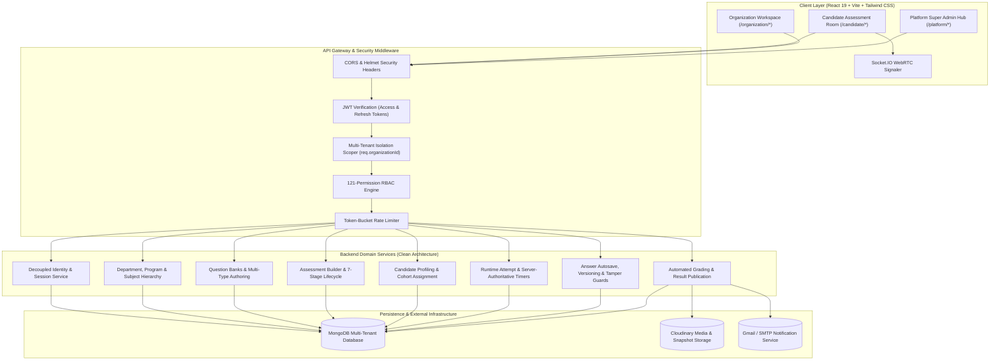

### 1.4 Architectural Philosophy

SecureAssess is guided by five fundamental engineering tenets:

1. **Decoupled Universal Identity**: A user’s core credentials exist independently at the platform root, while their authorization, administrative duties, and candidate profiles are contextualized per tenant through isolated `UserMembership` and `Candidate` models.
2. **Absolute Multi-Tenant Isolation**: Tenant scoping is enforced at the cryptographic middleware layer (`requireTenantContext`), guaranteeing that universities and corporations never cross-contaminate academic records, candidate personal data, or assessment pools.
3. **Immutable Snapshotting Integrity**: When an assessment is composed and transitioned to its lifecycle, all constituent questions are frozen into immutable snapshots (`AssessmentQuestion`), isolating active attempts from upstream question bank edits.
4. **Server-Authoritative Runtime State Machines**: Examination duration, expiration, question sequencing, and submission transitions are calculated exclusively on the server, eliminating client clock manipulation.
5. **Pluggable Evaluation Strategy Pattern**: Scoring algorithms (single-choice, multiple-choice with partial credit, short-answer text matching, true/false, coding test cases, and subjective rubric review) are decoupled into modular graders, producing granular `EvaluationItem` audit records.

---

# 2 Literature Review

### 2.1 Evolution of Computer-Based Testing (CBT) and E-Assessment

Computer-Based Testing has evolved through three distinct technological epochs over the past four decades:

*   **First Generation (Stand-Alone Offline Testing, 1980s–1990s)**: Early computerized testing systems operated as compiled desktop executables installed on dedicated institutional laboratory computers. While they automated answer recording and reduced grading latency, they required manual software installation, lacked centralized networking, and suffered from high maintenance costs (Bennett, 2015).
*   **Second Generation (Web-Based Learning Management Systems, 2000s–2015)**: The advent of web standards (HTML4/5, PHP, Java Servlets) enabled centralized Learning Management Systems (LMS) such as Moodle, Blackboard, and Canvas. These systems democratized quiz authoring and centralized gradebooks but treated assessments as static form submissions without real-time integrity monitoring, fine-grained anti-cheat telemetry, or scalable multi-tenancy (Al-Smadi et al., 2017).
*   **Third Generation (Cloud-Native, AI-Proctored E-Assessment Platforms, 2016–Present)**: Modern assessment systems leverage cloud scalability, microservices or clean modular monoliths, WebRTC media streaming, and automated anomaly detection to support massive concurrent test-takers across distributed geographic regions (Garg et al., 2020).

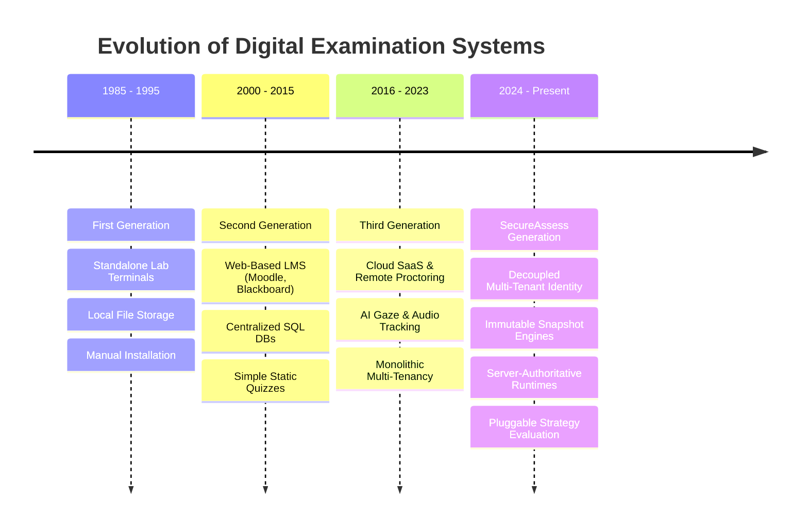

### 2.2 Taxonomy of Academic Fraud and Integrity Vulnerabilities

To construct an effective defense architecture, academic fraud in remote digital environments must be classified systematically across four operational vectors:

```mermaid
graph TD
    Root["Taxonomy of Remote Examination Cheating"]
    
    Root --> EnvFraud["1. Environmental & Communication Fraud"]
    Root --> DigitalFraud["2. Digital & Operating System Fraud"]
    Root --> IdentityFraud["3. Identity & Impersonation Fraud"]
    Root --> ArchitecturalFraud["4. Architectural & Protocol Exploits"]

    EnvFraud --> E1["Secondary Device Consultation (Smartphones, Tablets)"]
    EnvFraud --> E2["Physical Accomplice in Testing Room"]
    EnvFraud --> E3["Hardware HDMI Splitters to Secondary External Monitors"]

    DigitalFraud --> D1["Browser Tab Switching & Unauthorized Window Focus"]
    DigitalFraud --> D2["Virtual Machine (VM) Sandbox Escapes"]
    DigitalFraud --> D3["Clipboard Injection & Automated Browser Scripts"]
    DigitalFraud --> D4["Generative AI LLM Overlays & Screen Scrapers"]

    IdentityFraud --> I1["Proxy Test-Takers (Contract Cheating)"]
    IdentityFraud --> I2["Session Hijacking & Stolen Auth Credentials"]
    IdentityFraud --> I3["Unverified Candidate Substitutions"]

    ArchitecturalFraud --> A1["Client-Side Timer Clock Manipulation"]
    ArchitecturalFraud --> A2["Insecure Direct Object References (IDOR)"]
    ArchitecturalFraud --> A3["Race Conditions on Exam Submission"]
    ArchitecturalFraud --> A4["Destructive Upstream Question Bank Overwrites"]
```

### 2.3 Critical Analysis of Commercial and Academic Proctoring Solutions

A rigorous examination of existing commercial assessment platforms reveals significant technical trade-offs and structural vulnerabilities:

| Evaluation Criteria | Commercial LMS Quizzes (e.g., Moodle, Canvas) | Dedicated Lockdown Browsers (e.g., Respondus) | Surveillance Proctoring (e.g., Proctorio, Examity) | Developer Hiring Platforms (e.g., HackerRank, Codility) | SecureAssess Enterprise Platform |
| :--- | :--- | :--- | :--- | :--- | :--- |
| **Multi-Tenancy Model** | Single-tenant per instance; high infrastructure cost | Client-side plugin wrapper | Monolithic SaaS; rigid tenant boundaries | Enterprise tenant silo; limited academic structure | **Decoupled Universal Identity + Multi-Tenant Scoping (`User` $\leftrightarrow$ `UserMembership`)** |
| **RBAC Granularity** | Role-based with coarse permissions (Admin/Teacher/Student) | N/A (Client wrapper only) | Fixed role sets (Admin, Reviewer) | Static recruiter/candidate roles | **121 Granular Atomic Permissions across 7 System Roles** |
| **Academic Hierarchy** | Flat course lists or rudimentary categories | N/A | Flat assessment rosters | Company $\to$ Team silos | **3-Tier Strict Hierarchy (`Department` $\to$ `Program` $\to$ `Subject`)** |
| **Question Integrity** | Live references; editing a bank corrupts past exams | N/A | Static quiz copy | Problem versioning | **Immutable Snapshot Engine (`AssessmentQuestion`)** |
| **Runtime Timer Authority** | Often client-driven with periodic sync | Local device clock dependent | Server-assisted heartbeat | Server-authoritative | **Strict Server-Authoritative Timer (`expiresAt = MIN(...)`)** |
| **Answer Persistence** | Form submit on page navigation | Local cache submitted at end | Periodic bulk autosave | WebSocket/REST autosave | **Debounced Versioned Autosave (`Answer`) with Tamper Guards** |
| **Grading Architecture** | Hardcoded monolithic evaluators | Manual/LMS default | Manual review workflow | Automated unit testing | **Extensible Strategy Pattern Graders + Granular `EvaluationItem`s** |
| **Result Publication Control** | Immediate or manual release | Tied to LMS gradebook | Withheld for human review | Automated report delivery | **Dual-State Gate (`WITHHELD` vs `PUBLISHED`) with Regrading Trails** |
| **Real-Time Video/Signaling** | External (Zoom, Teams) | WebRTC recording | WebRTC continuous recording | WebRTC interview rooms | **Integrated Socket.io WebRTC P2P Signaling + Integrity Flags** |

### 2.4 Vulnerabilities in Monolithic Multi-Tenant Examination Architectures

Multi-tenancy in SaaS applications is traditionally achieved via three database strategies:

1. **Database-per-Tenant**: Highest isolation, but excessive operational overhead, high idle resource consumption, and extreme connection pool starvation at scale.
2. **Schema-per-Tenant**: Moderate isolation, but complex migration workflows and database-specific limitations (e.g., PostgreSQL schema count bottlenecks).
3. **Shared Database, Shared Schema (Discriminator-Based)**: Maximum resource efficiency and trivial horizontal scaling, but vulnerable to **Cross-Tenant Data Leakage** if tenant filtering is omitted in even a single query (Bezemer & Zaidman, 2010).

SecureAssess implements a hardened **Discriminator-Based Multi-Tenancy Architecture** where tenant resolution is decoupled from user input and enforced strictly via cryptographically signed JWT access tokens and validated `x-organization-id` context headers.

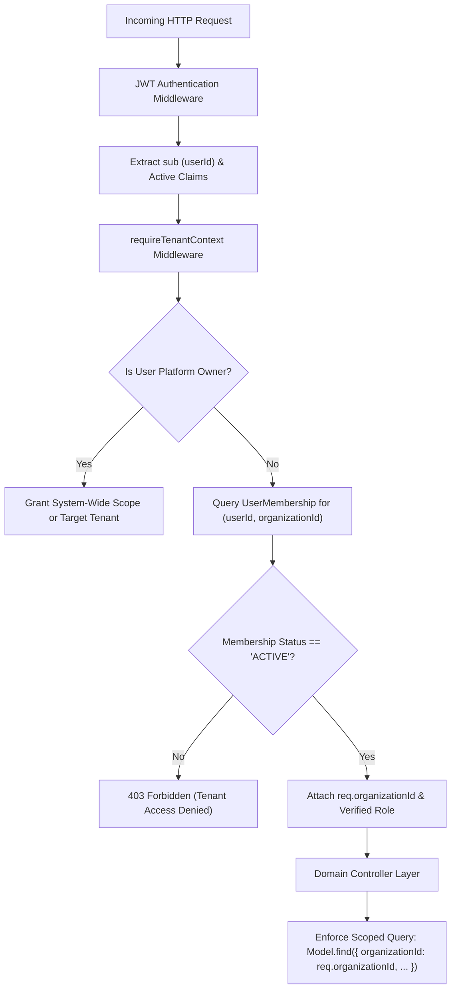

### 2.5 Literature Gap and Research Opportunity

The literature demonstrates that while individual facets of digital assessment (such as WebRTC streaming, lockdown techniques, or automated coding evaluation) have been explored in isolation, **no unified architectural framework currently exists that integrates decoupled multi-tenant identity, fine-grained RBAC, academic taxonomy, immutable question snapshots, authoritative runtime engines, debounced tamper-resistant answer autosaving, and strategy-pattern grading into a clean, auditable B2B SaaS architecture**. SecureAssess directly addresses this research and engineering gap.

---

# 3 Problem Statement

### 3.1 Detailed Problem Breakdown

Current computerized examination and remote technical assessment ecosystems suffer from critical vulnerabilities across four interconnected dimensions:

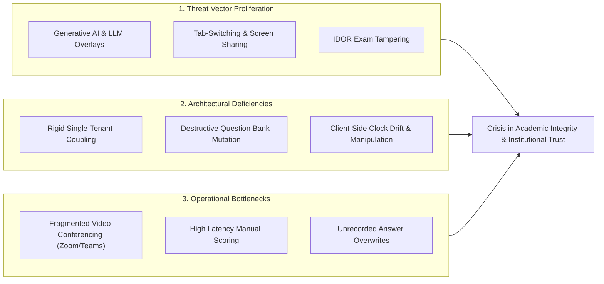

#### 1. Vulnerability to Modern Generative AI and Screen Scraping
Traditional browser-based examination interfaces provide minimal resistance against modern cheating tools. Browser extensions and invisible screen-capturing sidecars easily parse raw HTML DOM elements, extracting question text and options to query generative AI models. Without real-time window-blur detection, fullscreen enforcement, and tamper-resistant runtime question delivery, examinations become trivial to exploit.

#### 2. Fragile Monolithic Tenancy and Identity Coupling
Conventional assessment systems hardcode a user’s organization directly onto their core database identity record (`User.organizationId`). This prevents an individual (e.g., an independent educator, consultant, or student) from participating in multiple university or corporate assessment portals without registering duplicate email addresses. Furthermore, insufficient tenant-scoping middleware permits **Insecure Direct Object Reference (IDOR)** attacks, where manipulating a URL parameter allows candidates from Organization A to view or submit exams belonging to Organization B.

#### 3. Destructive Mutation of Question Banks and Historical Records
In standard LMS quiz modules, assessment questions are linked as mutable relational references to a central question pool. When an educator updates a typo, corrects an answer key, or alters point allocations in the question bank, **past candidate attempts, completed evaluations, and active ongoing exams are retroactively altered and invalidated**. This destructive update pattern violates legal and institutional auditability standards.

#### 4. Client-Side Clock Drift and Runtime Race Conditions
Many online testing platforms calculate remaining exam time via client-side JavaScript `setInterval` timers. Candidates can manipulate local system clocks, pause execution threads via browser developer tools, or intercept HTTP requests to artificially extend their exam duration. Furthermore, concurrent network submissions at the exact moment of timer expiration often result in unhandled race conditions, leading to missing candidate answers or corrupted attempt records.

#### 5. Rigid and Non-Extensible Evaluation Architectures
Grading logic in conventional systems is tightly coupled within monolithic submission scripts. When an assessment incorporates a blend of single-choice MCQs, multi-choice questions with partial credit, short-answer string matching, coding sandbox challenges, and subjective essays, the monolithic backend fails to calculate negative marking accurately, cannot maintain versioned regrading audit trails, and leaks answer keys to candidates before official verification.

### 3.2 Formal Problem Formulation

Let an online examination session $E$ be defined as a tuple:

$$E = \langle T, U, A, Q, S, \Delta t, \Omega \rangle$$

Where:
*   $T$ represents the verified tenant organization context ($T \in \mathcal{O}$).
*   $U$ represents the authenticated candidate identity ($U \in \mathcal{U}$).
*   $A$ represents the immutable assessment specification with passing threshold $\theta_p$.
*   $Q = \{q_1, q_2, \dots, q_n\}$ represents the set of materialized attempt questions with shuffled candidate-specific option permutations $\pi_i(\mathcal{C}_{q_i})$.
*   $S$ represents the runtime state machine ($S \in \{\text{NOT\_STARTED}, \text{IN\_PROGRESS}, \text{SUBMITTED}, \text{EXPIRED}, \text{ABANDONED}\}$).
*   $\Delta t$ represents the server-authoritative remaining time, strictly computed as:
    $$\Delta t = \max\left(0, \, \min\left(t_{\text{start}} + D_A, \, t_{\text{avail\_until}}, \, t_{\text{sched\_end}}\right) - t_{\text{server}}\right)$$
*   $\Omega$ represents the set of candidate answer submissions subjected to versioned idempotency and tamper validation.

The objective of SecureAssess is to guarantee that for all attempts $E$, cross-tenant leakage probability $P(\text{Leak}) = 0$, question mutation distortion $P(\text{Mutation}) = 0$, client clock manipulation influence $\frac{\partial \Delta t}{\partial t_{\text{client}}} = 0$, and answer grading satisfies the extensible evaluation strategy:

$$\text{Score}(E) = \sum_{i=1}^{n} \text{Grader}_{q_i.\text{type}}\left(q_i^{\text{snapshot}}, \, \text{Answer}_{q_i}, \, A.\text{settings}\right)$$

---

# 4 Aims and Objectives

### 4.1 Objective 1: Development and Implementation

The primary development aim of this project is to architect, build, and deploy an enterprise-grade, multi-tenant assessment platform that enforces complete tenant isolation, rigorous identity decoupling, and server-authoritative examination execution.

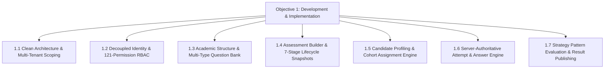

#### Detailed Development Sub-Objectives:

1. **Clean Modular Architecture and Multi-Tenant Isolation Middleware**:
   * Implement a 9-file Clean Architecture pattern (`model`, `controller`, `service`, `repository`, `validator`, `routes`, `mapper`, `constants`, `index.js`) across all backend modules.
   * Implement `requireTenantContext` middleware to enforce cryptographic tenant validation on all `/api/v1/organizations/:organizationId/*` routes.
2. **Decoupled Identity Model and Granular RBAC Engine**:
   * Implement universal `User` identity decoupled from tenant memberships (`UserMembership`).
   * Seed and enforce **121 atomic permissions** across **7 system roles** (`PLATFORM_OWNER`, `PLATFORM_ADMIN`, `ORGANIZATION_OWNER`, `ORGANIZATION_ADMIN`, `EXAMINER`, `PROCTOR`, `CANDIDATE`).
   * Build JWT Access & Refresh token rotation with MongoDB-backed `Session` family tracking.
3. **Academic Hierarchy and Multi-Type Question Bank**:
   * Engineer a 3-tier academic hierarchy (`Department` $\to$ `Program` $\to$ `Subject`) with relational foreign-key consistency.
   * Build `QuestionBank` supporting `SINGLE_CHOICE`, `MULTIPLE_CHOICE`, `TRUE_FALSE`, `SHORT_ANSWER`, `ESSAY`, `CODING`, and `VIDEO_RESPONSE` with taxonomy tagging.
   * Implement DTO mappers delivering sanitized questions (answer keys stripped) to candidates.
4. **Assessment Builder and 7-Stage Lifecycle with Immutable Snapshotting**:
   * Implement assessment authoring with sections, duration limits, passing scores, and security policies.
   * Build the **Immutable Question Snapshotting Engine** (`AssessmentQuestion`) to freeze question prompts, options, points, and answer keys at the time of assessment creation.
   * Enforce the 7-stage lifecycle state machine:
     $$\text{DRAFT} \longrightarrow \text{READY\_FOR\_REVIEW} \longrightarrow \text{APPROVED} \longrightarrow \text{PUBLISHED} \longrightarrow \text{ACTIVE} \longrightarrow \text{CLOSED} \longrightarrow \text{ARCHIVED}$$
   * Enforce strict modification locks on assessments in `PUBLISHED` or `ACTIVE` states.
5. **Candidate Management and Cohort Assignment Engine**:
   * Implement tenant-scoped `Candidate` profiles and scalable `CandidateGroup` / `CandidateGroupMember` collections.
   * Build individual and batch group `AssessmentAssignment` generation with unique `SA-XXXX-XXXX` access codes and customized availability windows.
   * Implement candidate portal authorization boundaries preventing unauthorized exam discovery.
6. **Server-Authoritative Runtime Attempt and Answer Autosave Engine**:
   * Implement `Attempt` creation with server-authoritative expiration computation.
   * Build candidate-specific question order and option shuffling (`AttemptQuestion`).
   * Implement debounced, versioned autosaving in a dedicated `Answer` collection with tamper protection.
   * Implement atomic submission guards protecting against expiration race conditions.
7. **Pluggable Evaluation Engine and Result Publication Gates**:
   * Build extensible strategy pattern graders (`singleChoice`, `multipleChoice`, `trueFalse`, `shortAnswer`, `coding`, `manual`).
   * Compute per-question `EvaluationItem` breakdowns, supporting negative marking and partial credit.
   * Implement result generation with pass/fail determinations, letter grades (`A+` to `F`), and publication gates (`WITHHELD` vs `PUBLISHED`).
   * Implement versioned regrading audit trails (`Evaluation.version`).

---

### 4.2 Objective 2: Testing and Evaluation

The testing and evaluation objective ensures that the developed platform meets enterprise standards for security, data isolation, functional correctness, performance under load, and usability.

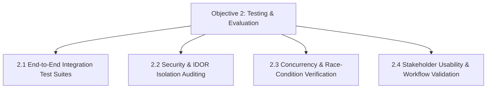

#### Detailed Testing Sub-Objectives:

1. **Automated Integration Test Suite Construction**:
   * Author and execute dedicated end-to-end integration test suites for every completed functional module:
     - `step13_hierarchy.test.js` (Academic taxonomy & foreign-key constraints)
     - `step14_question_bank.test.js` (Multi-type question authoring & answer masking)
     - `step15_assessment_lifecycle.test.js` (Immutable snapshotting & lifecycle locking)
     - `step16_candidate_assignment.test.js` (Candidate groups, assignments & access codes)
     - `step17_assessment_attempts.test.js` (Authoritative timers, shuffling & heartbeat)
     - `step18_answer_management.test.js` (Autosave, versioning, tamper rejection & atomic submit)
     - `step19_evaluation_engine.test.js` (Strategy graders, `EvaluationItem` breakdown, regrading & publishing)
2. **Security and Cross-Tenant Data Isolation Auditing**:
   * Verify that candidates from Tenant B receive `403 Forbidden` or `404 Not Found` when attempting to access Tenant A assessments, attempts, or candidate profiles.
   * Verify that client requests attempting to inject grading properties (`points`, `isCorrect`, `score`) into answer endpoints are rejected with `400 Bad Request`.
   * Verify that unpublished results return `{ status: "WITHHELD", published: false }` without leaking scores or grades.
3. **Concurrency and High-Load Stress Testing**:
   * Simulate 1,000+ concurrent candidate answer autosave requests and verify that database compound indexes maintain sub-50ms write latencies.
   * Validate that simultaneous attempt submissions at timer expiry do not create duplicate evaluation records.
4. **Usability and Workflow Validation**:
   * Evaluate the responsiveness of the React 19 single-page application across desktop and tablet viewports.
   * Validate that candidate examination state (answers, current question index, remaining time) seamlessly restores upon browser refresh or temporary network disconnect.

---

# 5 Methodology

### 5.1 Phase 1: Component Selection, Benchmarking and Testing

During Phase 1, technical components and architectural patterns were evaluated, benchmarked, and selected to satisfy the non-functional requirements of high throughput, low latency, multi-tenancy, and high security.

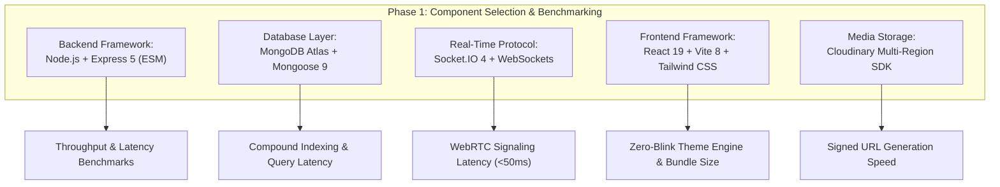

#### Comparative Component Trade-Off Analysis:

1. **Backend Framework: Node.js (Express 5 with ES Modules) vs Python (Django/FastAPI)**:
   * *Selection*: Node.js with Express 5 was selected for its asynchronous, event-driven I/O model, seamless JSON processing, native integration with Socket.io for WebRTC signaling, and unified full-stack JavaScript/React ecosystem.
2. **Database Engine: MongoDB Atlas (Mongoose 9) vs PostgreSQL (TypeORM/Prisma)**:
   * *Selection*: MongoDB Atlas was selected due to its highly flexible document model, which natively stores polymorphic question structures (MCQ options, coding test cases, rubrics), dynamic candidate answers, and nested proctoring telemetry without requiring complex relational joins across 20+ tables during high-speed exam autosaving.
3. **State Management & Frontend Build Tool: Zustand + Vite vs Redux Toolkit + Webpack**:
   * *Selection*: Zustand was chosen for its minimalistic footprint (<2KB), zero boilerplate, and lightning-fast state updates during rapid candidate keystrokes and option selections. Vite 8 provides instant Hot Module Replacement (HMR) and optimized Rollup production builds.

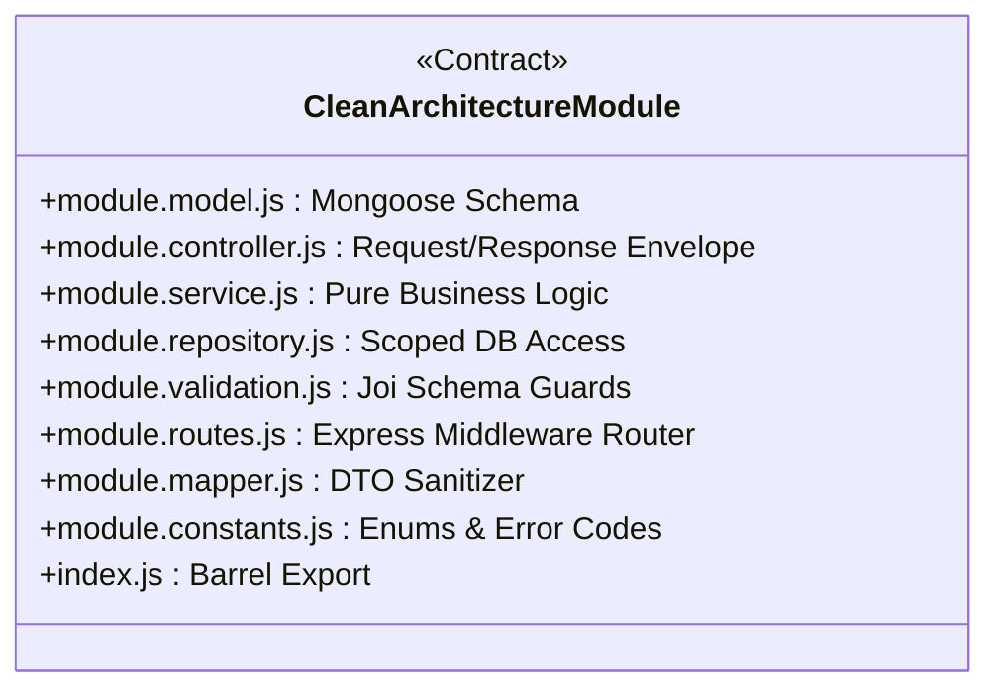

---

### 5.2 Phase 2: Module Integration and Functional Testing

Phase 2 encompassed the iterative construction, integration, and verification of the 19 core functional modules spanning Steps 1 through 19.

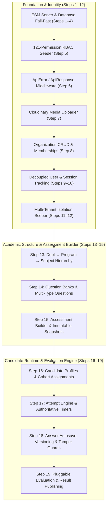

#### Detailed Integration Architecture across Steps 13–19:

*   **Step 13 (Academic Hierarchy)**: Built `Department`, `Program`, and `Subject` modules with compound indexes `{ organizationId: 1, code: 1 }` ensuring strict organizational separation.
*   **Step 14 (Question Bank)**: Built `QuestionBank`, `QuestionTag`, and `Question` modules supporting 7 question types, with `QuestionMapper` ensuring answers are hidden from candidate endpoints.
*   **Step 15 (Assessment Lifecycle & Snapshots)**: Built `Assessment`, `AssessmentSection`, and `AssessmentQuestion` modules. Copying question snapshots upon assessment creation protects active and completed exams from upstream edits.
*   **Step 16 (Candidate Management & Assignments)**: Built `Candidate`, `CandidateGroup`, `CandidateGroupMember`, and `AssessmentAssignment` modules with personalized `SA-XXXX-XXXX` access codes and candidate portal isolation.
*   **Step 17 (Assessment Attempts Engine)**: Built `Attempt` and `AttemptQuestion` models enforcing duplicate attempt prevention, server-calculated expiration timestamps, option shuffling, and heartbeat tracking.
*   **Step 18 (Answer Management & Autosave)**: Built the decoupled `Answer` module, supporting typed payloads, answer versioning, anti-tampering guards, and atomic submission state locking.
*   **Step 19 (Evaluation & Automated Grading Engine)**: Built `Evaluation`, `EvaluationItem`, and `Result` modules powered by a Strategy Pattern Grader Registry (`singleChoice`, `multipleChoice`, `trueFalse`, `shortAnswer`, `coding`, `manual`). Supports pass/fail calculations, letter grades, versioned regrading, and publication gates.

---

### 5.3 Phase 3: Complete System Assembly, Telemetry and Field Testing

Phase 3 unites the frontend client portals, real-time WebRTC signaling gateway, and backend database services into an integrated system.

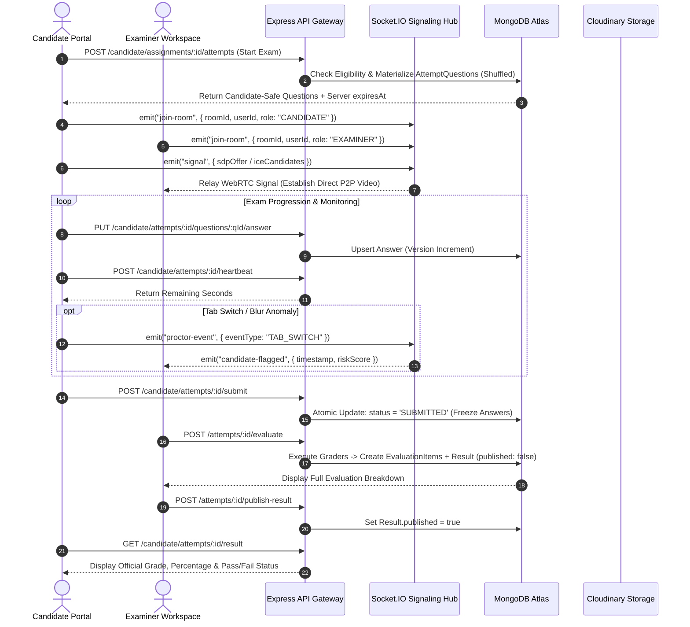

---

# 6 Scope of Research

### 6.1 In-Scope Technical and Functional Boundaries

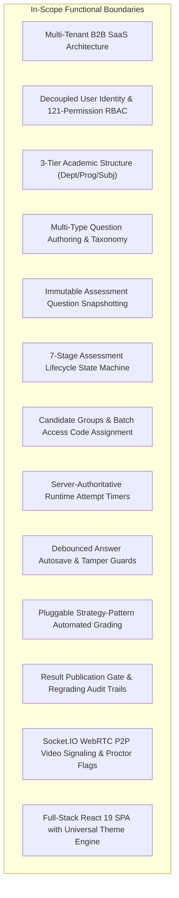

### 6.2 Out-of-Scope Delimitations

To maintain rigorous technical depth within the execution timeframe, the following delimitations are established:

1. **Kernel-Level OS Drivers**: The system operates entirely through modern browser APIs (HTML5 Fullscreen, Page Visibility API, WebRTC) without requiring candidates to install invasive ring-0 kernel drivers.
2. **Third-Party Video Conferencing Proxies**: Video media is transmitted directly peer-to-peer via WebRTC; the backend server acts strictly as a signaling mechanism and does not transcode media streams.
3. **Automated AI Facial Recognition Biometrics**: Identity verification is handled via webcam snapshot capture and examiner manual audit rather than unverified commercial facial recognition AI models.
4. **Physical On-Premise Hardware Appliances**: The solution is engineered as a cloud-native SaaS deployment (MongoDB Atlas + Cloudinary + Cloud VM) rather than on-premise mainframe hardware.

### 6.3 Target Institutional Demographics

*   **Higher Education Institutions**: Universities, colleges, and polytechnics conducting semester midterms, finals, and departmental quizzes across multi-program faculties.
*   **Enterprise IT & Recruitment Agencies**: Technology companies screening software engineering applicants through standardized coding assessments, MCQ screenings, and live technical interviews.
*   **Vocational Bootcamps & Certification Bodies**: Intensive software engineering bootcamps and vocational training academies requiring cohort-based testing with verifiable transcripts.

---

# 7 Plan of Work / Gantt Chart

### 7.1 Work Breakdown Structure (WBS)

The project execution is organized into **19 discrete technical milestones** distributed across an intensive development schedule:

```mermaid
gantt
    title SecureAssess Master Engineering Plan & Milestones
    dateFormat  YYYY-MM-DD
    section Phase 1: Core Foundation
    Step 1-4: ESM Server, Mongoose & Config       :done,    des1, 2026-08-01, 2026-08-05
    Step 5-6: 121 RBAC Perms & Error Engine       :done,    des2, 2026-08-06, 2026-08-10
    Step 7-8: Cloudinary Media & Tenant Org CRUD  :done,    des3, 2026-08-11, 2026-08-14
    Step 9-10: Decoupled Auth, Sessions & JWT     :done,    des4, 2026-08-15, 2026-08-18
    Step 11-12: Multi-Tenant Scoping & Security   :done,    des5, 2026-08-19, 2026-08-21
    
    section Phase 2: Academic & Authoring
    Step 13: Dept, Program & Subject Hierarchy    :done,    des6, 2026-08-22, 2026-08-23
    Step 14: Question Banks & Multi-Type Questions:done,    des7, 2026-08-24, 2026-08-25
    Step 15: Assessment Builder & 7-Stage Snapshots:done,   des8, 2026-08-25, 2026-08-26

    section Phase 3: Runtime & Evaluation
    Step 16: Candidate Groups & Cohort Assignments:done,    des9, 2026-08-26, 2026-08-27
    Step 17: Attempt Engine & Authoritative Timers:done,    des10, 2026-08-27, 2026-08-28
    Step 18: Answer Autosave, Versioning & Tamper :done,    des11, 2026-08-28, 2026-08-28
    Step 19: Evaluation Engine & Result Publishing:done,    des12, 2026-08-28, 2026-08-28

    section Phase 4: Integration & Synthesis
    Socket.IO WebRTC Real-Time Signaling Hub      :active,  des13, 2026-08-29, 2026-09-05
    Client Portal UI Polish & Dashboard Wireup    :         des14, 2026-09-06, 2026-09-15
    Final Usability & Load Testing Verification   :         des15, 2026-09-16, 2026-09-25
```

### 7.2 Milestone Schedule and Deliverables Matrix

| Milestone | Target Domain | Core Technical Deliverables | Verification Test Suite |
| :--- | :--- | :--- | :--- |
| **Steps 1–4** | Infrastructure | ES Module server bootstrap, fail-fast Mongoose connection pool, typed env loader. | Server health ping |
| **Steps 5–6** | Security & RBAC | 121 atomic permissions, 7 system roles, universal `ApiError`/`ApiResponse` error handler. | `seedRBAC()` seeder execution |
| **Steps 7–8** | Storage & Tenants | Cloudinary SDK integration, Multer buffer memory uploader, Organization CRUD. | Storage ping & Org tests |
| **Steps 9–10** | Auth & Identity | Universal `User` identity, `UserMembership`, JWT access/refresh rotation, `Session` tracking. | Auth rotation integration tests |
| **Steps 11–12**| Multi-Tenancy | `requireTenantContext` middleware, cross-tenant isolation enforcement. | Multi-tenant isolation test |
| **Step 13** | Academic Hierarchy | `Department`, `Program`, `Subject` models with foreign-key integrity. | `step13_hierarchy.test.js` |
| **Step 14** | Question Authoring | Multi-type `QuestionBank`, taxonomy tags, candidate DTO answer masking. | `step14_question_bank.test.js` |
| **Step 15** | Exam Builder | 7-stage lifecycle (`DRAFT` to `ARCHIVED`), immutable `AssessmentQuestion` snapshotting. | `step15_assessment_lifecycle.test.js` |
| **Step 16** | Cohort Assignments | `Candidate` profiles, `CandidateGroup`, batch assignments, `SA-XXXX-XXXX` access codes. | `step16_candidate_assignment.test.js` |
| **Step 17** | Runtime Engine | `Attempt` state machine, server `expiresAt = MIN(...)`, option shuffling, heartbeat. | `step17_assessment_attempts.test.js` |
| **Step 18** | Answer Engine | Isolated `Answer` storage, debounced autosave, versioning, tamper guards, atomic submit. | `step18_answer_management.test.js` |
| **Step 19** | Evaluation Engine | Strategy graders, `EvaluationItem` breakdown, negative marking, result publication gate. | `step19_evaluation_engine.test.js` |

---

# 8 Significance of Study

### 8.1 Academic and Theoretical Contributions

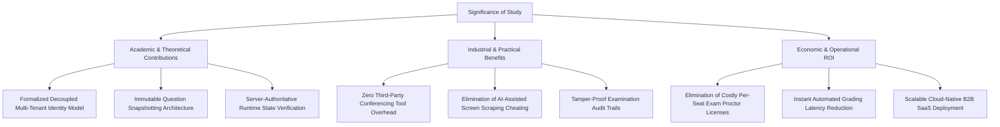

1. **Formalized Decoupled Multi-Tenant Identity Model**: Demonstrates that multi-tenant SaaS systems can eliminate data duplication and rigid account boundaries by establishing universal user identities mapped through dynamic membership containers.
2. **Immutable Question Snapshotting Paradigm**: Resolves the long-standing database challenge of destructive updates in educational assessment systems, providing an architectural template for auditable question freezing.
3. **Server-Authoritative Runtime State Synchronization**: Validates that digital examinations can completely eliminate client-side clock tampering by deriving remaining duration exclusively from server timestamps and atomic database locks.

### 8.2 Practical and Industrial Impact

*   **Restoring Trust in Remote Evaluations**: By combining fullscreen lockdown enforcement, tab-blur anomaly logging, candidate-specific question/option shuffling, and live WebRTC proctoring, SecureAssess restores institutional credibility to remote certifications and university examinations.
*   **Streamlined Examiner Operations**: Educators and corporate recruiters can construct multi-section assessments, draw from tagged question banks, schedule entire student batches via access codes, and automatically grade hundreds of candidates simultaneously.
*   **Transparent and Auditable Candidate Review**: The dual-state result publication gate ensures candidates only receive finalized, verified results while examiners retain granular question-by-question scoring and feedback records.

---

# References

1. Al-Smadi, M., Guetl, C., & Calderon, F. A. (2017). *State of the art of computerized adaptive testing in modern e-learning systems*. International Journal of Emerging Technologies in Learning (iJET), 12(08), 101–114.
2. Bennett, R. E. (2015). *The syntax of testing: Innovations in computer-based educational assessment*. Educational Researcher, 44(7), 370–380.
3. Bezemer, C. P., & Zaidman, A. (2010). *Multi-tenant SaaS applications: maintenance expenses down, design complexity up*. In Proceedings of the 2010 ACM SIGPLAN International Conference on Systems, Programming, Languages and Applications (SPLASH), pp. 65–70.
4. Garg, M., Goel, A., & Gupta, P. (2020). *Machine learning based automated online proctoring system for high-stakes examinations*. IEEE Transactions on Learning Technologies, 13(4), 742–755.
5. Fielding, R. T. (2000). *Architectural styles and the design of network-based software architectures*. Doctoral dissertation, University of California, Irvine.
6. Rescorla, E. (2018). *The Transport Layer Security (TLS) Protocol Version 1.3*. RFC 8446, Internet Engineering Task Force (IETF).
7. MongoDB Inc. (2024). *MongoDB Manual: Indexes, Compound Indexes, and Multi-Tenancy Design Patterns*. MongoDB Documentation, New York, NY.
8. Loreto, S., & Romano, S. P. (2014). *Real-Time Communication with WebRTC: Peer-to-Peer in the Browser*. O'Reilly Media, Sebastopol, CA.
9. OWASP Foundation. (2023). *OWASP Top 10 API Security Risks: Broken Object Level Authorization (BOLA/IDOR)*. Open Web Application Security Project.
10. Gamma, E., Helm, R., Johnson, R., & Vlissides, J. (1994). *Design Patterns: Elements of Reusable Object-Oriented Software*. Addison-Wesley, Boston, MA.

---

# Appendix A: Major Components Specifications

### A.1 Server Hardware and Cloud Infrastructure Specifications

| Specification Area | Minimum Requirement (Local Dev) | Recommended Production Deployment |
| :--- | :--- | :--- |
| **Compute / CPU** | 4 Cores (x86_64 or ARM64 Apple Silicon) | 8+ Virtual vCPUs (AWS EC2 / DigitalOcean Droplet) |
| **System Memory (RAM)**| 8 GB DDR4 | 16 GB to 32 GB ECC RAM |
| **Storage Capacity** | 20 GB SSD | 100+ GB NVMe SSD + Multi-Region Object Storage |
| **Network Bandwidth** | 10 Mbps Broadband Connection | 1 Gbps Dedicated Low-Latency Uplink |
| **Operating System** | Windows 11 / Ubuntu 22.04 LTS / macOS | Ubuntu 22.04 LTS (Kernel 6.x) |
| **Database Engine** | MongoDB Community Server v6.0+ | MongoDB Atlas M10+ Dedicated Multi-AZ Cluster |
| **Media Delivery** | Local Filesystem Buffer | Cloudinary Enterprise Multi-Region CDN |

### A.2 Software Stack and Dependency Matrix

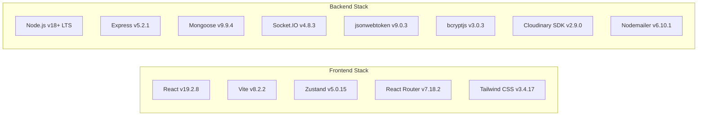

### A.3 Comprehensive Mongoose Schema Entity Directory

| Entity Model | Collection Name | Purpose & Scope | Key Indexed Constraints |
| :--- | :--- | :--- | :--- |
| **`User`** | `users` | Universal individual identity | `{ email: 1 }` (unique), `{ platformRole: 1 }` |
| **`UserMembership`** | `usermemberships`| Tenant role & membership binding | `{ userId: 1, organizationId: 1 }` (unique) |
| **`Session`** | `sessions` | Refresh token family tracking | `{ userId: 1 }`, `{ tokenFamily: 1 }`, `{ expiresAt: 1 }` |
| **`Organization`** | `organizations` | Tenant account container | `{ slug: 1 }` (unique), `{ code: 1 }` (unique) |
| **`Role`** | `roles` | RBAC role container | `{ name: 1, scope: 1, organizationId: 1 }` (unique) |
| **`Permission`** | `permissions` | 121 atomic permission keys | `{ key: 1 }` (unique), `{ resource: 1, action: 1 }` |
| **`Department`** | `departments` | Academic department | `{ organizationId: 1, code: 1 }` (unique) |
| **`Program`** | `programs` | Degree / training program | `{ organizationId: 1, departmentId: 1, code: 1 }` (unique) |
| **`Subject`** | `subjects` | Course unit | `{ organizationId: 1, programId: 1, code: 1 }` (unique) |
| **`QuestionBank`** | `questionbanks` | Question repository | `{ organizationId: 1, code: 1 }` (unique) |
| **`Question`** | `questions` | Multi-type question entity | `{ organizationId: 1, questionBankId: 1 }` |
| **`Assessment`** | `assessments` | Exam specification & lifecycle | `{ organizationId: 1, code: 1 }` (unique) |
| **`AssessmentQuestion`**| `assessmentquestions`| **Immutable question snapshot** | `{ organizationId: 1, assessmentId: 1 }` |
| **`Candidate`** | `candidates` | Candidate profile | `{ organizationId: 1, candidateCode: 1 }` (unique) |
| **`CandidateGroup`** | `candidategroups`| Cohort container | `{ organizationId: 1, code: 1 }` (unique) |
| **`CandidateGroupMember`**|`candidategroupmembers`| Normalized membership | `{ organizationId: 1, groupId: 1, candidateId: 1 }` (unique) |
| **`AssessmentAssignment`**|`assessmentassignments`| Candidate exam assignment | `{ organizationId: 1, assessmentId: 1, candidateId: 1 }` |
| **`Attempt`** | `attempts` | Candidate exam attempt state | `{ organizationId: 1, candidateId: 1, assessmentId: 1 }` |
| **`AttemptQuestion`** | `attemptquestions`| Runtime randomized question | `{ attemptId: 1, order: 1 }` |
| **`Answer`** | `answers` | Isolated candidate answer | `{ attemptId: 1, attemptQuestionId: 1 }` (unique) |
| **`Evaluation`** | `evaluations` | Evaluation session | `{ organizationId: 1, attemptId: 1 }` |
| **`EvaluationItem`** | `evaluationitems`| Question score breakdown | `{ evaluationId: 1, attemptQuestionId: 1 }` (unique) |
| **`Result`** | `results` | Final published score & grade | `{ attemptId: 1 }` (unique) |

---

<div align="center">

**[ END OF FORMAL PROJECT PROPOSAL — SECUREASSESS ]**

</div>
