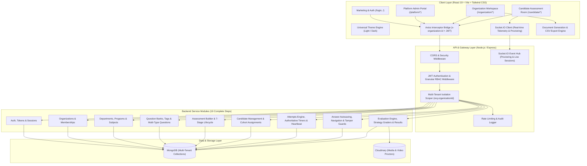
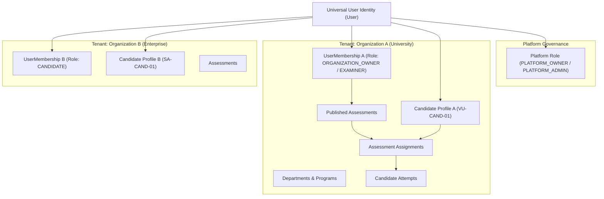
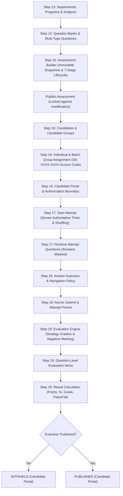

# 🏛️ SecureAssess — Complete Architecture, Implementation Status & Roadmap

---

## 1. High-Level System Architecture

---

## 2. Multi-Tenant Security & Decoupled Identity Model

SecureAssess decouples the universal user identity from specific tenant memberships and candidate profiles:

---

## 3. End-to-End Examination Execution Pipeline (Steps 13–19)

---

## 4. Implementation Status Matrix (Steps 1–19)

| Step | Area / Module | Core Functionality & Status | Verification Test Suite |
| :---: | :--- | :--- | :--- |
| **1–4** | **Repository Foundation** | Express 4, Mongoose, ESM, Environment Config & Seeders | Unit & DB Connections |
| **5** | **Granular RBAC** | 121 Granular Permissions, 7 System Roles (`seedRBAC()`) | Permission Matrix |
| **6** | **Universal Error Handling** | Standard `ApiError`, `ApiResponse`, and `asyncHandler` | Centralized Error MW |
| **7** | **Media Upload** | Cloudinary integration for proctor snapshots & media assets | Media Uploader |
| **8** | **Organization Management** | Complete CRUD `/api/v1/organizations` with tenant lifecycle | Integration Tests |
| **9** | **Decoupled User Identity** | Universal `User` $\leftrightarrow$ `UserMembership` architecture | Step 9 Tests |
| **10** | **Authentication & Security** | JWT Access & Refresh Tokens, Session tracking, Rate Limiting | Step 10 Tests |
| **11–12** | **Multi-Tenancy Isolation** | `requireTenantContext` & strict cross-tenant protection | Step 12 Tests |
| **13** | **Academic Hierarchy** | Departments, Programs & Subjects with cross-tenant FK verification | `step13_hierarchy.test.js` |
| **14** | **Question Bank** | Multi-type questions (`MCQ`, `CODING`, `ESSAY`, `TRUE_FALSE`), Tags, Categories | `step14_question_bank.test.js` |
| **15** | **Assessment Builder** | Immutable snapshotting, 7-stage lifecycle, modification locking | `step15_assessment_lifecycle.test.js` |
| **16** | **Candidate & Assignment** | Candidate profiles, Groups, Access codes, Authorization boundary | `step16_candidate_assignment.test.js` |
| **17** | **Assessment Attempts** | Authoritative timer, duplicate attempt protection, question & option shuffling | `step17_assessment_attempts.test.js` |
| **18** | **Answer Management** | Structured answer autosave, back-navigation policy, atomic submission lock | `step18_answer_management.test.js` |
| **19** | **Evaluation & Results** | Strategy graders, `EvaluationItem` breakdown, regrading, result publication | `step19_evaluation_engine.test.js` |
