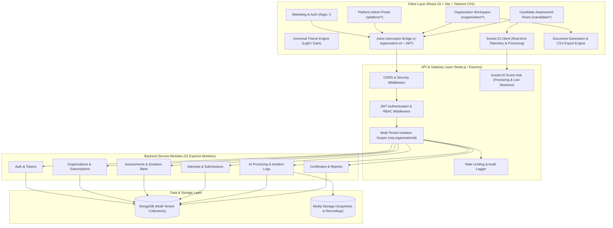
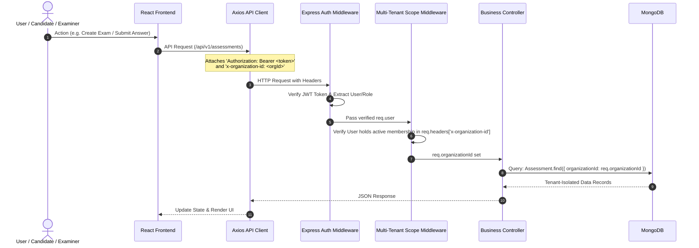

# 🏛️ SecureAssess — Complete Architecture, Implementation Status & Roadmap

---

## 1. High-Level System Architecture

---

## 2. Multi-Tenant Security & Data Scoping Architecture

---

## 3. Implementation Status Matrix

### 🟢 Fully Implemented & Live

| Module / Area | Component / Route | Status | Notes |
| :--- | :--- | :---: | :--- |
| **Theme & Design System** | Universal Light / Dark Theme Engine | **100% DONE** | Zero-blink, persistent via localStorage & DOM class |
| | UI Component Library (`Button`, `Card`, `Badge`, `Input`, `Charts`, `Misc`, `Layout`) | **100% DONE** | Unified design tokens, high contrast, responsive |
| **Public & Authentication** | Marketing Landing Page (`/`) | **100% DONE** | Feature sections, pricing, multi-tenancy overview |
| | Multi-Persona Authentication (`/login`) | **100% DONE** | Quick persona logins for Super Admin, Org Admin, Candidate |
| | Request Demo Intake (`/request-demo`) | **100% DONE** | Institutional intake form |
| **Platform Super Admin** | Platform Hub (`/platform/dashboard`) | **100% DONE** | ARR telemetry, health ring gauges, tenant count |
| | Tenant Roster (`/platform/organizations`) | **100% DONE** | Organizations table with slide-in drawer overview |
| | Provision Tenant (`/platform/onboarding`) | **100% DONE** | 7-step tenant provisioning wizard |
| **Organization Workspace** | Overview Dashboard (`/organization/dashboard`) | **100% DONE** | Operations metrics, queue, throughput charts |
| | Assessment Library (`/organization/assessments`) | **100% DONE** | Dynamic backend fetching, skeleton cards, filters |
| | Assessment Builder (`/organization/builder`) | **100% DONE** | Question authoring, live publish/draft endpoints, toast feedback |
| | Question Bank (`/organization/question-bank`) | **100% DONE** | Dynamic question pool, creation modal, delete actions |
| | Candidate Management (`/organization/participants`) | **100% DONE** | Enrollment modal, cohort assignment, skeleton table |
| | Candidate Dossier (`/organization/participants/profile`) | **100% DONE** | Anomaly scores, proctoring telemetry tabs |
| | Proctoring Center (`/organization/integrity`) | **100% DONE** | Real-time WebSocket anomaly stream & risk profile gauges |
| | Evidence Review (`/organization/integrity/evidence`) | **100% DONE** | Video frame preview & examiner action form |
| | Session Recordings (`/organization/sessions/*`) | **100% DONE** | Video playback scrubber mock & duration logs |
| | Live Interviews (`/organization/interviews`) | **100% DONE** | Interview scheduling cards & status indicators |
| | Evaluations & Rubrics (`/organization/evaluations`) | **100% DONE** | Scoring matrices & evaluator remarks |
| | Certified Reports (`/organization/reports`) | **100% DONE** | Real CSV generation & high-res PDF certificate transcripts |
| | Team Roster (`/organization/users`) | **100% DONE** | Staff invitation modal with role privilege selection |
| | Resource Billing (`/organization/billing`) | **100% DONE** | Quota meters, license plans, invoice table |
| | Workspace Settings (`/organization/settings`) | **100% DONE** | Identity, branding palette, security switches |
| **Candidate Portal** | System Readiness Check (`/candidate/system-check`) | **100% DONE** | Camera, microphone, network speed checklist |
| | Integrity Consent (`/candidate/consent`) | **100% DONE** | Conduct code agreement and telemetry disclosures |
| | Examination Room (`/candidate/assessment`) | **100% DONE** | Auto-saving drafts, anti-cheat tab-blur sockets, submission modal |
| | Candidate Feedback (`/candidate/evaluation`) | **100% DONE** | 5-star rubric scoring and feedback form |
| **Backend API Engine** | 31 Express / Mongoose Modules | **100% DONE** | Schemas, routes, and controllers established |
| | Multi-Tenant Scoping Middleware | **100% DONE** | `x-organization-id` header validation & JWT verification |
| **Document Generation** | Client-Side CSV & PDF Certificate Engine | **100% DONE** | Automated CSV downloads & printable verified transcripts |
