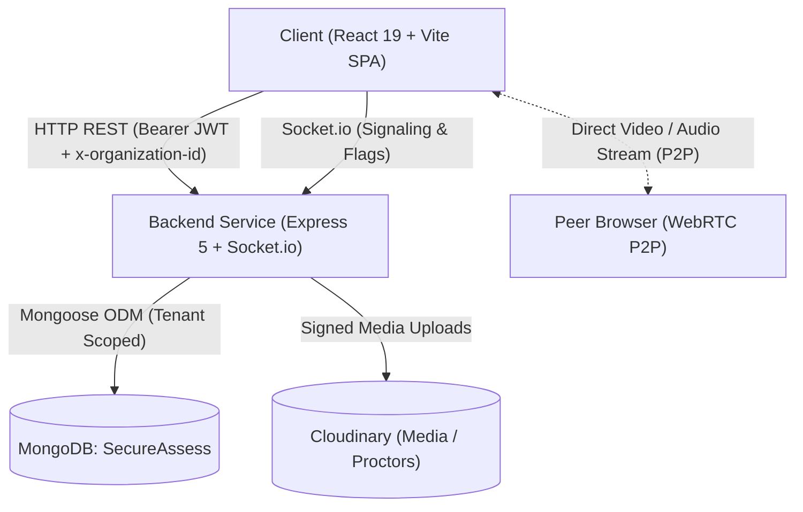
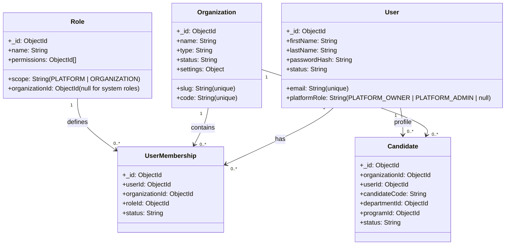
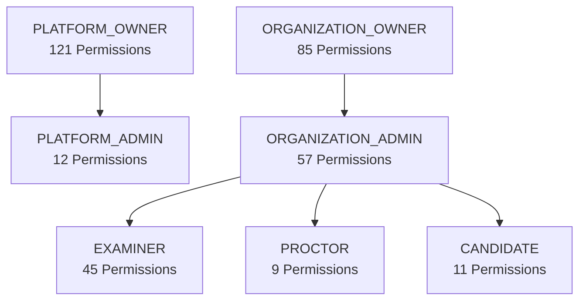
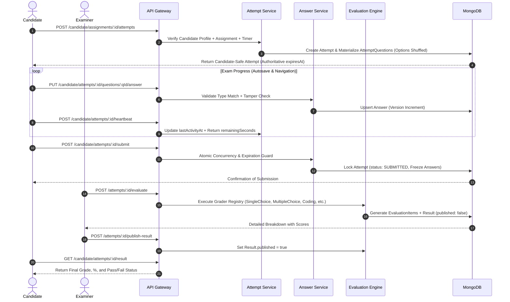

# SecureAssess — System Architecture

This document describes the architectural patterns, security model, request lifecycle, data isolation mechanisms, and runtime engine across the SecureAssess platform.

---

## 1. High-Level System Architecture

SecureAssess uses a decoupled, multi-tenant client-server architecture. The frontend is a React Single-Page Application (SPA), while the backend is an Express HTTP REST API and Socket.io WebRTC/proctoring signaling service.

### Key Architectural Characteristics
1. **Direct Peer-to-Peer Media**: Media streams (video, audio, screen share) flow directly between candidate and recruiter/proctor browsers using WebRTC. The backend acts solely as a signaling channel (exchanging SDP offers, answers, and ICE candidates) and never proxies audio/video payloads directly.
2. **Fail-Fast Database Bootstrapping**: The Express application and Socket.io listeners do not accept incoming traffic until the MongoDB connection is fully established and validated (`server/src/server.js`).
3. **Decoupled Identity Model**: Users exist globally at the platform layer and participate in individual tenant organizations via explicit memberships rather than being hardcoded to a single tenant.
4. **Immutable Question Snapshots**: Assessments copy question snapshots (`prompt`, `options`, `correctAnswer`, `points`, `difficulty`) into `AssessmentQuestion` records at authoring time. Question bank modifications never alter ongoing or past examinations.
5. **Runtime Attempt Questions & Anti-Tampering**: Candidates receive randomized `AttemptQuestion` records with masked answer keys (`correctAnswer` stripped) and shuffled options.

---

## 2. Decoupled Identity & Multi-Tenant Model

SecureAssess decouples universal user identity from organization tenancy. A single `User` record can belong to multiple independent `Organization` instances with different roles in each.

---

## 3. Role-Based Access Control (RBAC) Matrix

SecureAssess includes an RBAC engine consisting of **121 granular permissions** categorized under `PLATFORM` or `ORGANIZATION` scopes, mapped across **7 system roles**.

### Role Hierarchy & Responsibilities

| Role | Scope | Summary of Access |
| :--- | :---: | :--- |
| **`PLATFORM_OWNER`** | `PLATFORM` | Root administrator with total control over all platform settings, organizations, subscriptions, billing, and logs. |
| **`PLATFORM_ADMIN`** | `PLATFORM` | Platform support staff with read/audit access to organizations, users, subscriptions, and logs. |
| **`ORGANIZATION_OWNER`** | `ORGANIZATION` | Primary tenant administrator with full authority over organization profile, staff, assessments, exams, candidates, and reports. |
| **`ORGANIZATION_ADMIN`** | `ORGANIZATION` | Operational tenant administrator managing staff, schedules, question banks, cohort assignments, and grading workflows. |
| **`EXAMINER`** | `ORGANIZATION` | Academic/recruiter user who creates questions, builds assessments, schedules cohorts, and evaluates candidate attempts. |
| **`PROCTOR`** | `ORGANIZATION` | Live exam supervisor with permissions to monitor candidate streams, review flags, and record violations. |
| **`CANDIDATE`** | `ORGANIZATION` | Examinee with strictly scoped self-permissions to start attempts, autosave answers, submit exams, and view published results. |

---

## 4. Examination Runtime & Evaluation Pipeline

