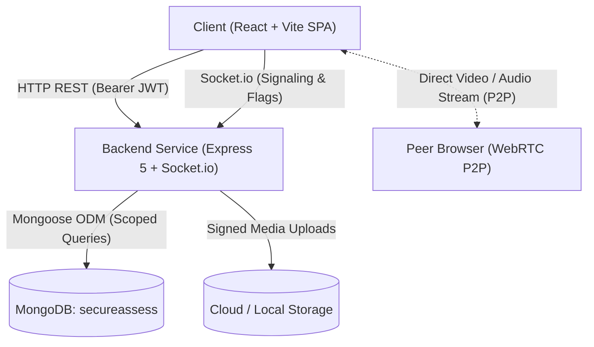
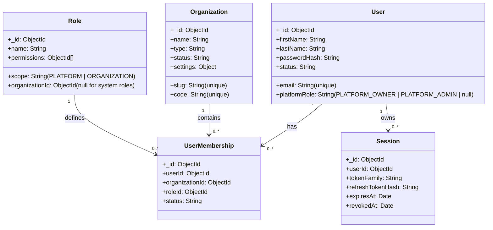
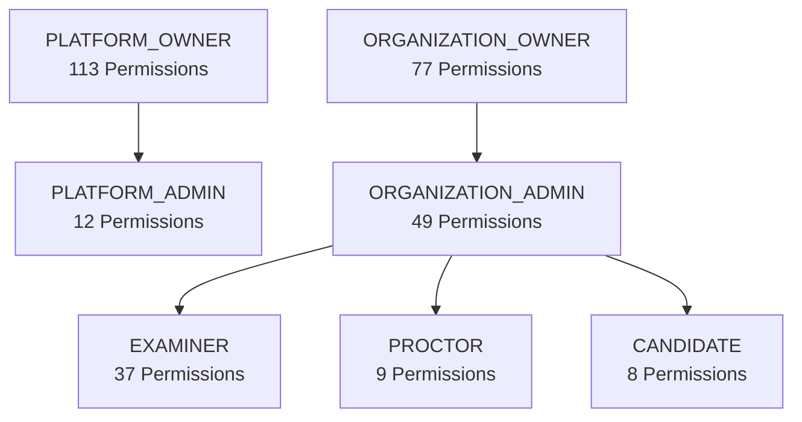
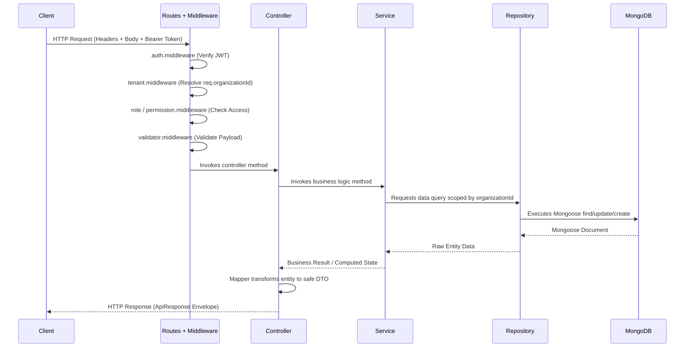
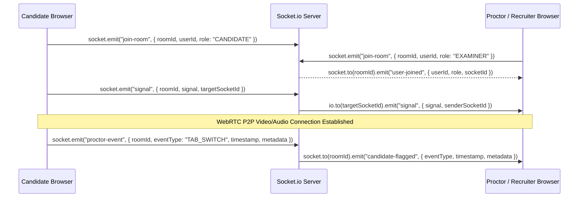

# SecureAssess — System Architecture

This document describes the architectural patterns, security model, request lifecycle, data isolation mechanisms, and cross-cutting concerns implemented across the SecureAssess platform.

---

## 1. High-Level System Architecture

SecureAssess uses a decoupled, multi-tenant client-server architecture. The frontend is a React Single-Page Application (SPA), while the backend is an Express HTTP REST API and Socket.io WebRTC/proctoring signaling service.



### Key Architectural Characteristics
1. **Direct Peer-to-Peer Media**: Media streams (video, audio, screen share) flow directly between candidate and recruiter/proctor browsers using WebRTC. The backend acts solely as a signaling channel (exchanging SDP offers, answers, and ICE candidates) and never proxies audio/video payloads directly.
2. **Fail-Fast Database Bootstrapping**: The Express application and Socket.io listeners do not accept incoming traffic until the MongoDB connection is fully established and validated (`server/src/server.js`).
3. **Decoupled Identity Model**: Users exist globally at the platform layer and participate in individual tenant organizations via explicit memberships rather than being hardcoded to a single tenant.

---

## 2. Decoupled Identity & Multi-Tenant Model

SecureAssess decouples universal user identity from organization tenancy. A single `User` record can belong to multiple independent `Organization` instances with different roles in each.



### Tenancy Scopes

| Scope | Description | Entities / Permissions Included |
| :--- | :--- | :--- |
| **`PLATFORM`** | System-wide administrative oversight. Not bound to any `organizationId`. | Platform settings, global metrics, tenant management, system subscriptions, billing. |
| **`ORGANIZATION`** | Isolated tenant boundary. All operations require a verified `organizationId`. | Question banks, assessments, candidate assignments, attempts, proctoring events, results, certificates, departments. |

### Data Isolation Rules
1. **Mandatory `organizationId` Field**: Every tenant-owned Mongoose collection (`assessments`, `attempts`, `questions`, etc.) must include an indexed `organizationId` reference.
2. **Never Trust Client-Sent Tenant IDs**: The `tenant.middleware.js` extracts `organizationId` exclusively from the cryptographically verified JWT (`req.user.organizationId`). Any client attempt to provide `?organizationId=XYZ` or `{ organizationId: "XYZ" }` in the request body is overwritten with the token-bound value.
3. **Platform Owner Override**: Only users holding `platformRole: "PLATFORM_OWNER"` or `PLATFORM_ADMIN` can operate platform-wide or explicitly target an organization via headers (`x-tenant-id`, `x-organization-id`).

---

## 3. Role-Based Access Control (RBAC) Matrix

SecureAssess includes an RBAC engine consisting of **113 granular permissions** categorized under `PLATFORM` or `ORGANIZATION` scopes, mapped across **7 system roles**.

### Role Hierarchy & Responsibilities



| Role | Scope | Perms Count | Summary of Access |
| :--- | :---: | :---: | :--- |
| **`PLATFORM_OWNER`** | `PLATFORM` | **113** | Root administrator with total control over all platform settings, organizations, subscriptions, billing, and logs. |
| **`PLATFORM_ADMIN`** | `PLATFORM` | **12** | Platform support staff with read/audit access to organizations, users, subscriptions, and logs. |
| **`ORGANIZATION_OWNER`** | `ORGANIZATION` | **77** | Primary tenant administrator with full authority over organization profile, staff, assessments, exams, and reports. |
| **`ORGANIZATION_ADMIN`** | `ORGANIZATION` | **49** | Operational tenant administrator managing staff, schedules, question banks, and grading workflows. |
| **`EXAMINER`** | `ORGANIZATION` | **37** | Academic/recruiter user who creates questions, builds assessments, and grades candidates. |
| **`PROCTOR`** | `ORGANIZATION` | **9** | Live exam supervisor with permissions to monitor candidate streams, review flags, and record violations. |
| **`CANDIDATE`** | `ORGANIZATION` | **8** | Examinee with strictly scoped permissions to create/update own attempts and view own results/certificates. |

---

## 4. Backend Modular Clean Architecture

Backend modules inside [`server/src/modules/`](file:///c:/Users/theun/OneDrive/Desktop/FYP/SecureAssess/server/src/modules) adhere to a 9-file Clean Architecture structure:

```
moduleName/
├── moduleName.model.js        # Mongoose Schema & domain model definition
├── moduleName.controller.js   # HTTP Request/Response handling (req, res, ApiResponse)
├── moduleName.service.js      # Pure business logic and domain orchestration
├── moduleName.repository.js   # Scoped data access layer (direct database queries)
├── moduleName.validator.js    # Payload/query validation logic (Joi / custom schemas)
├── moduleName.routes.js       # Express route declarations & middleware bindings
├── moduleName.mapper.js       # DTO transformation layer (removes sensitive attributes)
├── moduleName.constants.js    # Module-level enums, error messages, and defaults
└── index.js                   # Barrel export file exposing router, service, repository
```

### Module Responsibilities & Separation of Concerns



---

## 5. End-to-End Request Lifecycle

Every incoming HTTP request traverses a standardized middleware pipeline before reaching domain business logic:

1. **Security Headers (`security.middleware.js`)**: Sets HTTP response headers (`X-Content-Type-Options: nosniff`, `X-Frame-Options: DENY`, `X-XSS-Protection: 1; mode=block`, `Strict-Transport-Security`, `Referrer-Policy`).
2. **CORS Validation (`config/cors.js`)**: Matches origin against configured `CORS_ORIGIN` environment settings.
3. **Payload Parsers (`app.js`)**: `express.json({ limit: "16kb" })` and `express.urlencoded({ extended: true, limit: "16kb" })` protect against oversized payloads.
4. **Rate Limiting (`rateLimit.middleware.js`)**: In-memory token bucket rate limiter (default: 200 requests per 60 seconds per IP).
5. **Tenant Resolver (`tenant.middleware.js`)**: Resolves tenant context from authenticated user identity or public headers.
6. **Authentication Guard (`auth.middleware.js`)**: Verifies cryptographic JWT access token from `Authorization: Bearer <token>` header, decodes payload, and attaches `req.user`.
7. **Role & Permission Guards (`role.middleware.js`, `permission.middleware.js`)**: Validates that `req.user` holds the required system roles or granular permission keys.
8. **Request Validator (`validation.middleware.js`)**: Validates request body, params, or query against schemas before controller invocation.
9. **Controller & Service Layer**: Executes core business workflow and repository access.
10. **Global Error Interceptor (`error.middleware.js`)**: Catches uncaught exceptions or instances of `ApiError`, returning a standardized JSON error response.

---

## 6. Real-Time WebRTC & Proctoring Signaling

Real-time signaling is handled via Socket.io in [`server/src/server.js`](file:///c:/Users/theun/OneDrive/Desktop/FYP/SecureAssess/server/src/server.js):



### Supported Socket Events

| Event Name | Direction | Payload | Purpose |
| :--- | :---: | :--- | :--- |
| `join-room` | Client $\rightarrow$ Server | `{ roomId, userId, role }` | Joins a designated assessment or interview room. |
| `user-joined` | Server $\rightarrow$ Room | `{ userId, role, socketId }` | Notifies existing room participants of a new peer. |
| `signal` | Bidirectional | `{ roomId, signal, targetSocketId }` | Relays WebRTC SDP offers, answers, and ICE candidates between peers. |
| `proctor-event` | Candidate $\rightarrow$ Server | `{ roomId, eventType, timestamp, metadata }` | Emits an integrity violation event (e.g. `TAB_SWITCH`, `FULLSCREEN_EXIT`). |
| `candidate-flagged` | Server $\rightarrow$ Room | `{ eventType, timestamp, metadata }` | Notifies proctors/examiners of an integrity violation in real time. |

---

## 7. Cross-Cutting Concerns

### Error Handling & Standard Responses
All API responses follow uniform JSON structures defined by `ApiResponse` and `ApiError`:

**Success Response Envelope (`ApiResponse`)**:
```json
{
  "statusCode": 200,
  "data": { ... },
  "message": "Success message",
  "success": true
}
```

**Error Response Envelope (`ApiError`)**:
```json
{
  "statusCode": 400,
  "message": "Validation failed",
  "success": false,
  "errors": ["Email is required", "Password must be at least 8 characters"],
  "stack": "..." // Only present in development (NODE_ENV=development)
}
```

### Configuration & Environment Management
Environment settings are centralized in [`server/src/config/env.js`](file:///c:/Users/theun/OneDrive/Desktop/FYP/SecureAssess/server/src/config/env.js), loading either `server/.env` or root `.env` with fallback defaults. The resulting `ENV` object is frozen using `Object.freeze` to prevent runtime mutation.
