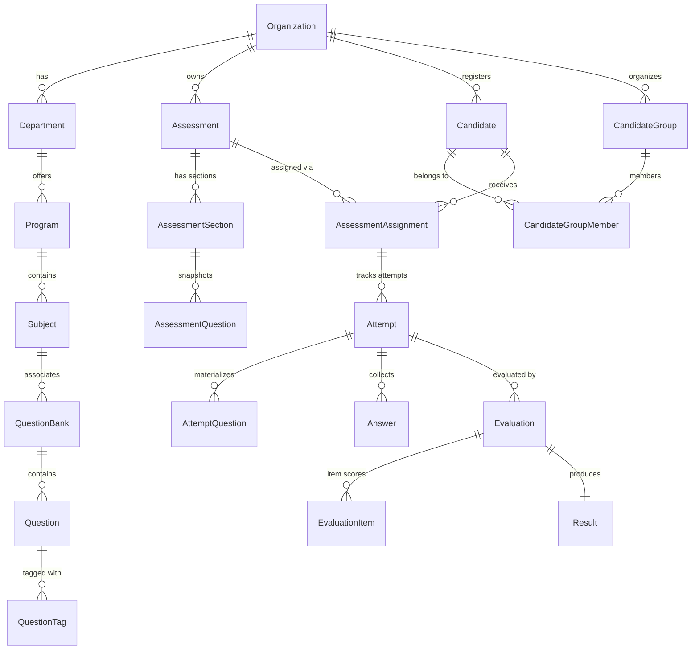

# SecureAssess — Complete Data Model & Schema Reference

This document provides schema specifications, field types, relationships, compound indexes, and multi-tenant rules for all Mongoose data models implemented in the SecureAssess platform (Steps 1–19).

---

## 1. Relational Architecture & Collections

---

## 2. Model Index & Schemas

### 2.1 Academic Hierarchy
- **`Department`** (`departments`): `{ organizationId: 1, code: 1 }` (Unique).
- **`Program`** (`programs`): `{ organizationId: 1, departmentId: 1, code: 1 }` (Unique).
- **`Subject`** (`subjects`): `{ organizationId: 1, programId: 1, code: 1 }` (Unique).

### 2.2 Question Bank & Taxonomy
- **`QuestionBank`** (`questionbanks`): `{ organizationId: 1, code: 1 }` (Unique), `{ organizationId: 1, subjectId: 1 }`.
- **`QuestionTag`** (`questiontags`): `{ organizationId: 1, name: 1 }` (Unique).
- **`QuestionCategory`** (`questioncategories`): `{ organizationId: 1, code: 1 }` (Unique).
- **`Question`** (`questions`):
  - Types: `SINGLE_CHOICE`, `MULTIPLE_CHOICE`, `TRUE_FALSE`, `SHORT_ANSWER`, `ESSAY`, `CODING`, `VIDEO_RESPONSE`.
  - Fields: `prompt`, `options: [{ id, text, isCorrect }]`, `correctAnswer: [String]`, `points`, `difficulty`, `explanation`, `status`.

### 2.3 Assessment Builder & Lifecycle
- **`Assessment`** (`assessments`):
  - Lifecycle: `DRAFT` $\to$ `READY_FOR_REVIEW` $\to$ `APPROVED` $\to$ `PUBLISHED` $\to$ `ACTIVE` $\to$ `CLOSED` $\to$ `ARCHIVED`.
  - Fields: `code`, `title`, `durationSeconds`, `passingScore`, `settings: { shuffleQuestions, shuffleOptions, allowBackNavigation, allowUnanswered, allowResume, maxAttempts, negativeMarking, negativeMarkingPenalty, allowPartialCredit, showResultImmediately }`.
- **`AssessmentSection`** (`assessmentsections`): `{ organizationId: 1, assessmentId: 1, order: 1 }`.
- **`AssessmentQuestion`** (`assessmentquestions`):
  - **Immutable Question Snapshot**: Copies `prompt`, `options`, `correctAnswer`, `points` at assessment composition time so question bank changes never distort ongoing or completed exams.

### 2.4 Candidate Management & Assignments
- **`Candidate`** (`candidates`):
  - Fields: `candidateCode`, `firstName`, `lastName`, `email`, `departmentId`, `programId`, `status: ACTIVE | INVITED | SUSPENDED | DEACTIVATED`.
  - Indexes: `{ organizationId: 1, candidateCode: 1 }` (Unique), `{ organizationId: 1, email: 1 }`.
- **`CandidateGroup`** (`candidategroups`): `{ organizationId: 1, code: 1 }` (Unique).
- **`CandidateGroupMember`** (`candidategroupmembers`): `{ organizationId: 1, groupId: 1, candidateId: 1 }` (Unique).
- **`AssessmentAssignment`** (`assessmentassignments`):
  - Materialized candidate assignment binding `assessmentId` $\leftrightarrow$ `candidateId` with `accessCode` (`SA-XXXX-XXXX`), `availableFrom`, `availableUntil`, `attemptLimit`, `status: ASSIGNED | INVITED | STARTED | COMPLETED | EXPIRED | REVOKED`.

### 2.5 Examination Runtime: Attempts & Answers
- **`Attempt`** (`attempts`):
  - Fields: `attemptNumber`, `status: IN_PROGRESS | SUBMITTED | EXPIRED | ABANDONED`, `startedAt`, `expiresAt`, `durationSeconds`, `lastActivityAt`, `answeredQuestions`, `totalQuestions`.
  - Authoritative Server Timing: `expiresAt = MIN(startedAt + duration, assignment.availableUntil, assessment.scheduling.endAt)`.
- **`AttemptQuestion`** (`attemptquestions`):
  - Runtime randomized representation with candidate-specific option order and stripped `correctAnswer`/`isCorrect`.
- **`Answer`** (`answers`):
  - Fields: `attemptId`, `attemptQuestionId`, `answer: { selectedOptionId, selectedOptionIds, text, code, language }`, `answerType`, `isAnswered`, `version: Number`, `savedAt`, `submittedAt`.
  - Index: `{ attemptId: 1, attemptQuestionId: 1 }` (Unique).

### 2.6 Evaluation Engine & Results
- **`Evaluation`** (`evaluations`):
  - Fields: `status: PENDING | IN_PROGRESS | COMPLETED | FAILED`, `evaluationType: AUTOMATIC | MANUAL | HYBRID | AI_ASSISTED`, `totalPoints`, `earnedPoints`, `percentage`, `version`.
- **`EvaluationItem`** (`evaluationitems`):
  - Question-level score records with max points, earned points, percentage, status, feedback, and evaluator ID.
  - Index: `{ evaluationId: 1, attemptQuestionId: 1 }` (Unique).
- **`Result`** (`results`):
  - Fields: `totalPoints`, `earnedPoints`, `percentage`, `grade` (`A+`, `A`, `B`, `C`, `D`, `F`), `passed: Boolean`, `published: Boolean`, `publishedAt`, `publishedBy`.
  - Index: `{ attemptId: 1 }` (Unique).
