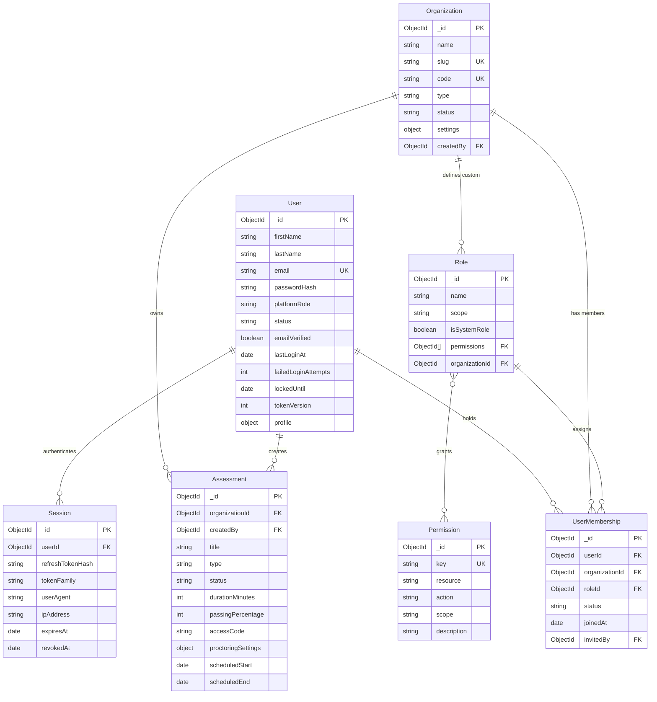

# SecureAssess — Data Model & Schema Reference

This document provides schema specifications, field types, relationships, indexes, and tenancy rules for all Mongoose data models implemented in the SecureAssess backend.

---

## 1. Database Overview & Conventions

- **Database Engine**: MongoDB (v6.0+)
- **Database Name**: `secureassess` (configured via `MONGODB_DB_NAME` / `MONGODB_URI`)
- **ODM**: Mongoose v9.9.4
- **Timestamps**: All collections enable `{ timestamps: true }`, automatically managing `createdAt` and `updatedAt` ISO 8601 Date fields.
- **Relational Integrity**: Foreign keys utilize `mongoose.Schema.Types.ObjectId` with explicit `ref` model declarations.

---

## 2. Entity-Relationship Overview

---

## 3. Detailed Model Schemas

### 3.1 `User` Collection (`users`)
Stores universal user identities. Designed to decouple individual identity from organization tenancy.

- **Source File**: [`server/src/modules/users/user.model.js`](file:///c:/Users/theun/OneDrive/Desktop/FYP/SecureAssess/server/src/modules/users/user.model.js)

| Field | Type | Required | Default | Description |
| :--- | :--- | :---: | :--- | :--- |
| `_id` | `ObjectId` | Auto | Auto | Primary key |
| `firstName` | `String` | Yes | — | User's given name (trimmed) |
| `lastName` | `String` | No | `""` | User's family name (trimmed) |
| `email` | `String` | Yes | — | Unique login email (lowercased, trimmed) |
| `passwordHash` | `String` | Yes | — | Bcrypt hashed password string |
| `platformRole` | `String` | No | `null` | System platform authority: `PLATFORM_OWNER`, `PLATFORM_ADMIN`, or `null` |
| `status` | `String` | No | `ACTIVE` | Account status: `ACTIVE`, `INACTIVE`, `SUSPENDED` |
| `emailVerified` | `Boolean` | No | `false` | Email verification flag |
| `emailVerifiedAt`| `Date` | No | `null` | Timestamp when email was verified |
| `lastLoginAt` | `Date` | No | `null` | Timestamp of most recent authentication |
| `failedLoginAttempts` | `Number` | No | `0` | Consecutive failed login counter |
| `lockedUntil` | `Date` | No | `null` | Lockout expiration timestamp |
| `passwordChangedAt` | `Date` | No | `null` | Timestamp of last password modification |
| `tokenVersion` | `Number` | No | `0` | Token revocation counter |
| `profile.avatar` | `String` | No | `""` | Avatar image URL |
| `profile.phone` | `String` | No | `""` | Phone number |
| `profile.bio` | `String` | No | `""` | User biographical summary |
| `profile.timezone` | `String` | No | `"UTC"` | Preferred timezone identifier |
| `createdAt` | `Date` | Auto | Auto | Record creation timestamp |
| `updatedAt` | `Date` | Auto | Auto | Record update timestamp |

**Indexes**:
- `{ email: 1 }` (Unique)
- `{ platformRole: 1 }`
- `{ status: 1 }`
- `{ status: 1, createdAt: -1 }`
- `{ platformRole: 1, status: 1 }`

---

### 3.2 `UserMembership` Collection (`usermemberships`)
Connects a `User` to an `Organization` with a specific `Role`.

- **Source File**: [`server/src/modules/users/userMembership.model.js`](file:///c:/Users/theun/OneDrive/Desktop/FYP/SecureAssess/server/src/modules/users/userMembership.model.js)

| Field | Type | Required | Default | Description |
| :--- | :--- | :---: | :--- | :--- |
| `_id` | `ObjectId` | Auto | Auto | Primary key |
| `userId` | `ObjectId` | Yes | — | Reference to `User` |
| `organizationId` | `ObjectId` | Yes | — | Reference to `Organization` |
| `roleId` | `ObjectId` | Yes | — | Reference to `Role` |
| `status` | `String` | No | `ACTIVE` | Membership status (`ACTIVE`, `INACTIVE`, `SUSPENDED`) |
| `joinedAt` | `Date` | No | `Date.now` | Date user joined the organization |
| `invitedBy` | `ObjectId` | No | `null` | Reference to `User` who sent invitation |

**Indexes**:
- `{ userId: 1, organizationId: 1 }` (Unique compound constraint)
- `{ organizationId: 1, roleId: 1 }`
- `{ organizationId: 1, status: 1 }`

---

### 3.3 `Session` Collection (`sessions`)
Tracks active client login sessions and manages refresh token rotation.

- **Source File**: [`server/src/modules/auth/session.model.js`](file:///c:/Users/theun/OneDrive/Desktop/FYP/SecureAssess/server/src/modules/auth/session.model.js)

| Field | Type | Required | Default | Description |
| :--- | :--- | :---: | :--- | :--- |
| `_id` | `ObjectId` | Auto | Auto | Primary key |
| `userId` | `ObjectId` | Yes | — | Reference to `User` |
| `refreshTokenHash` | `String` | Yes | — | Cryptographic hash of the active refresh token |
| `tokenFamily` | `String` | Yes | — | UUID identifying the token family for rotation/reuse detection |
| `userAgent` | `String` | No | `""` | Client User-Agent string |
| `ipAddress` | `String` | No | `""` | Client IP address |
| `expiresAt` | `Date` | Yes | — | Expiration timestamp |
| `lastUsedAt` | `Date` | No | `Date.now` | Timestamp when session was last refreshed |
| `revokedAt` | `Date` | No | `null` | Revocation timestamp if invalidated |

**Indexes**:
- `{ userId: 1 }`
- `{ refreshTokenHash: 1 }`
- `{ tokenFamily: 1 }`
- `{ expiresAt: 1 }`
- `{ userId: 1, revokedAt: 1 }`
- `{ tokenFamily: 1, revokedAt: 1 }`

---

### 3.4 `Organization` Collection (`organizations`)
Represents customer tenants (universities, enterprises, bootcamps).

- **Source File**: [`server/src/modules/organizations/organization.model.js`](file:///c:/Users/theun/OneDrive/Desktop/FYP/SecureAssess/server/src/modules/organizations/organization.model.js)

| Field | Type | Required | Default | Description |
| :--- | :--- | :---: | :--- | :--- |
| `_id` | `ObjectId` | Auto | Auto | Primary key |
| `name` | `String` | Yes | — | Organization display name |
| `slug` | `String` | Yes | — | Unique URL-friendly slug (lowercased) |
| `code` | `String` | Yes | — | Unique uppercase organization identifier |
| `type` | `String` | Yes | `CORPORATE` | `UNIVERSITY`, `COLLEGE`, `SCHOOL`, `CORPORATE`, `TRAINING_INSTITUTE`, `RECRUITMENT_AGENCY`, `OTHER` |
| `email` | `String` | No | `""` | Official contact email |
| `phone` | `String` | No | `""` | Official contact phone |
| `website` | `String` | No | `""` | Organization website URL |
| `logo.url` | `String` | No | `""` | Hosted logo image URL |
| `logo.publicId` | `String` | No | `""` | Cloud storage public asset ID |
| `description` | `String` | No | `""` | Organization summary |
| `address` | `Object` | No | `{}` | Address object (`addressLine1`, `city`, `state`, `country`, `postalCode`) |
| `status` | `String` | No | `ACTIVE` | `ACTIVE`, `PENDING_VERIFICATION`, `SUSPENDED`, `DEACTIVATED` |
| `settings.timezone` | `String` | No | `"UTC"` | Default timezone |
| `settings.locale` | `String` | No | `"en-US"` | Default locale |
| `settings.dateFormat`| `String` | No | `"YYYY-MM-DD"` | Preferred date formatting |
| `settings.branding` | `Object` | No | `{ primaryColor, secondaryColor }` | Custom brand styling colors |
| `settings.assessmentDefaults` | `Object` | No | `{ durationMinutes: 60, passingPercentage: 50, enforceFullscreen: true, ... }` | Default assessment rules |
| `subscriptionId` | `ObjectId` | No | `null` | Reference to active `Subscription` |
| `createdBy` | `ObjectId` | No | `null` | Reference to `User` who registered the org |

**Indexes**:
- `{ slug: 1 }` (Unique)
- `{ code: 1 }` (Unique)
- `{ status: 1 }`
- `{ status: 1, createdAt: -1 }`

---

### 3.5 `Role` Collection (`roles`)
Defines permission containers at either `PLATFORM` or `ORGANIZATION` scope.

- **Source File**: [`server/src/modules/roles/role.model.js`](file:///c:/Users/theun/OneDrive/Desktop/FYP/SecureAssess/server/src/modules/roles/role.model.js)

| Field | Type | Required | Default | Description |
| :--- | :--- | :---: | :--- | :--- |
| `_id` | `ObjectId` | Auto | Auto | Primary key |
| `name` | `String` | Yes | — | Role identifier (e.g. `PLATFORM_OWNER`, `ORGANIZATION_ADMIN`, `EXAMINER`) |
| `scope` | `String` | Yes | — | Scope enum: `PLATFORM` or `ORGANIZATION` |
| `description` | `String` | No | `""` | Description of role duties |
| `isSystemRole` | `Boolean` | No | `false` | `true` for built-in immutable system roles |
| `permissions` | `ObjectId[]`| No | `[]` | Array of `Permission` references |
| `organizationId` | `ObjectId` | No | `null` | `null` for system roles, `ObjectId` for custom tenant roles |

**Indexes**:
- `{ name: 1, scope: 1, organizationId: 1 }` (Unique compound constraint)

---

### 3.6 `Permission` Collection (`permissions`)
Registry of 113 fine-grained atomic capabilities.

- **Source File**: [`server/src/modules/permissions/permission.model.js`](file:///c:/Users/theun/OneDrive/Desktop/FYP/SecureAssess/server/src/modules/permissions/permission.model.js)

| Field | Type | Required | Default | Description |
| :--- | :--- | :---: | :--- | :--- |
| `_id` | `ObjectId` | Auto | Auto | Primary key |
| `key` | `String` | Yes | — | Unique key (e.g., `assessments.create`, `platform.view`) |
| `resource` | `String` | Yes | — | Resource domain (e.g., `assessments`, `organizations`) |
| `action` | `String` | Yes | — | Action name (e.g., `create`, `publish`, `view_own`) |
| `scope` | `String` | Yes | — | Scope enum: `PLATFORM` or `ORGANIZATION` |
| `description` | `String` | No | `""` | Human-readable explanation of allowed action |

**Indexes**:
- `{ key: 1 }` (Unique)
- `{ resource: 1, action: 1 }`
- `{ scope: 1, resource: 1 }`

---

### 3.7 `Assessment` Collection (`assessments`)
Represents an exam, quiz, interview, or coding test created within an organization.

- **Source File**: [`server/src/modules/assessments/assessment.model.js`](file:///c:/Users/theun/OneDrive/Desktop/FYP/SecureAssess/server/src/modules/assessments/assessment.model.js)

| Field | Type | Required | Default | Description |
| :--- | :--- | :---: | :--- | :--- |
| `_id` | `ObjectId` | Auto | Auto | Primary key |
| `organizationId` | `ObjectId` | Yes | — | Tenant owner reference (`Organization`) |
| `createdBy` | `ObjectId` | Yes | — | User author reference (`User`) |
| `title` | `String` | Yes | — | Assessment title (trimmed) |
| `description` | `String` | No | `""` | Full assessment instructions |
| `type` | `String` | No | `MCQ` | `MCQ`, `CODING`, `VIDEO_INTERVIEW`, `HYBRID`, `ESSAY` |
| `status` | `String` | No | `DRAFT` | `DRAFT`, `PUBLISHED`, `ACTIVE`, `COMPLETED`, `ARCHIVED` |
| `durationMinutes` | `Number` | No | `60` | Test time limit in minutes |
| `passingPercentage`| `Number`| No | `50` | Minimum score percentage to pass |
| `accessCode` | `String` | No | `null` | Optional passcode required to start attempt |
| `proctoringSettings.enforceFullscreen` | `Boolean` | No | `true` | Requires candidate to lock browser in fullscreen |
| `proctoringSettings.trackTabSwitches` | `Boolean` | No | `true` | Emits violations on blur / window switch |
| `proctoringSettings.maxTabSwitchesAllowed`| `Number`| No | `3` | Allowed threshold before flagging/submission |
| `proctoringSettings.enableWebcamMonitoring` | `Boolean` | No | `true` | Requests webcam feed for proctoring |
| `proctoringSettings.enableAudioDetection` | `Boolean` | No | `false` | Enables microphone audio spike alerts |
| `scheduledStart` | `Date` | No | `null` | Scheduled start time window |
| `scheduledEnd` | `Date` | No | `null` | Scheduled closing time window |

**Indexes**:
- `{ organizationId: 1 }`
- `{ organizationId: 1, status: 1 }`
- `{ organizationId: 1, createdAt: -1 }`
